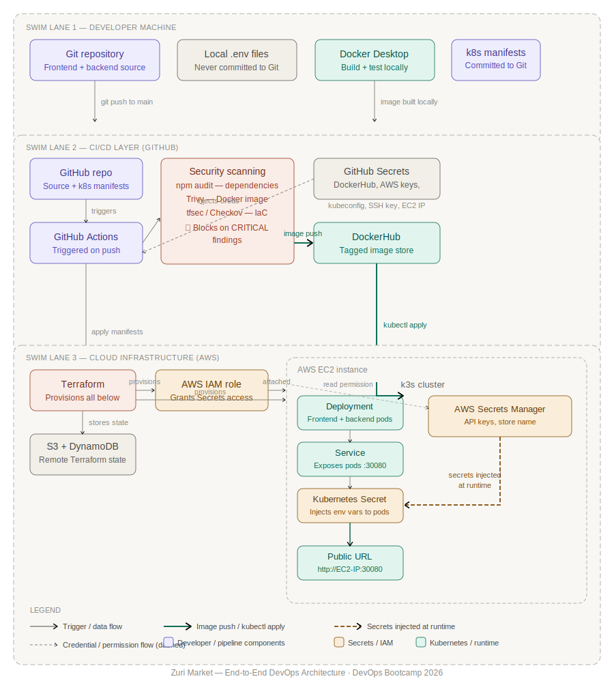
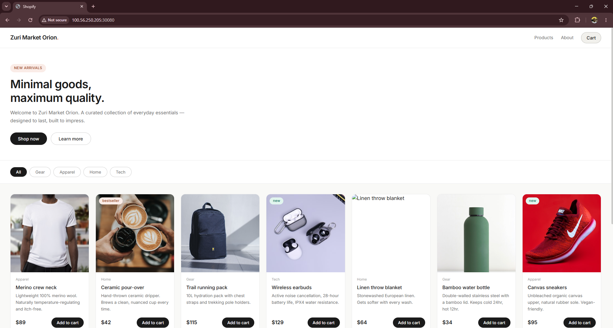

# Zuri Market — Frontend

## 1. Project Overview

This is the customer-facing storefront for Zuri Market. It displays a product catalog with filtering, lets users build a cart, and connects to the Zuri Market backend [Zuri Market - Backend](https://github.com/Tonyb23/zuri-market-orion-backend) API over HTTP for live product data and cart validation.  
The app is built with React and Vite, compiled to static files, containerised with a two-stage Docker build (Node.js → nginx), and deployed automatically to a k3s Kubernetes cluster on AWS EC2 via a GitHub Actions CI/CD pipeline.

## Related Repositories

[Zuri Market - Backend](https://github.com/Tonyb23/zuri-market-orion-backend)
[Zuri Market - Infrastructure](https://github.com/Tonyb23/zuri-market-orion-infrastructure)

## Architecture Diagram



## 2. Tech Stack

- **React** 18.3 UI Library
- **Vite** 6.4 (dev server + production bundler)
- **@vitejs/plugin-react** — React Fast Refresh support for Vite
- Plain CSS (custom properties), no CSS framework
- **Node.js 18+** required to install dependencies and run the dev server/build (the Docker image is built on `node:18-alpine`)
- **nginx** — Serves the compiled static files in production


## 3. Project Structure

```
zuri-market-orion-frontend/
├── .github/
│   └── workflows/
│       └── deploy.yml        # CI/CD: test, audit, build, scan, push, deploy to k3s
├── k8s/
│   └── deployment.yaml         # Kubernetes Deployment + NodePort Service
├── src/
│   ├── components/
│   │   ├── Navbar.jsx          # Store name, nav links, cart button with item-count badge
│   │   ├── Hero.jsx             # Landing banner: headline, intro copy, CTA buttons
│   │   ├── FilterBar.jsx        # Category filter pills (All / Gear / Apparel / Home / Tech)
│   │   ├── ProductGrid.jsx      # Grid layout + loading skeletons, error state, empty state
│   │   ├── ProductCard.jsx      # Single product card with image, price, "Add to cart"
│   │   └── CartSidebar.jsx      # Slide-out cart: line items, quantity steppers, subtotal
│   ├── hooks/
│   │   └── useCart.js            # Cart state: add/remove/update/clear, derived count & total
│   ├── App.jsx                    # Top-level state, data fetching, wires everything together
│   ├── main.jsx                    # React root render
│   └── index.css                    # Global styles & CSS custom properties (theme variables)
├── index.html                          # HTML entry point, loads /src/main.jsx as a module
├── vite.config.js                       # Dev server port + /api proxy to the backend
├── Dockerfile                            # Two-stage build: Node build stage → Nginx runtime
├── .dockerignore
├── .env.example                            # Template listing required environment variables
├── .gitignore
├── package.json
└── package-lock.json
```

### Component Reference

- **`Navbar.jsx`** — Renders the store name and a cart button with an item-count badge. Receives `storeName`, `cartCount`, `onCartOpen`.
- **`Hero.jsx`** — Renders the landing banner/headline below the navbar. Receives `storeName`.
- **`FilterBar.jsx`** — Renders the row of category pills (`all`, `gear`, `apparel`, `home`, `tech`). Receives `activeCategory`, `onCategoryChange`.
- **`ProductGrid.jsx`** — Renders the grid of products, or a skeleton/error/empty state depending on fetch status. Receives `products`, `loading`, `error`, `onAddToCart`.
- **`ProductCard.jsx`** — Renders a single product (image, category, name, description, price, "Add to cart" button). Receives `product`, `onAddToCart`.
- **`CartSidebar.jsx`** — Renders the slide-out cart with line items, quantity steppers, subtotal, and checkout/clear buttons. Receives `cartItems`, `cartTotal`, `onRemove`, `onUpdateQuantity`, `onClear`, `onClose`.
- **`useCart.js`** — Custom hook holding cart state and exposing `cartItems`, `addToCart`, `removeFromCart`, `updateQuantity`, `clearCart`, `cartCount`, `cartTotal`.
- **`App.jsx`** — Fetches `/api/store` and `/api/products` on load and whenever the active category changes, manages cart-sidebar open/close state, and passes data/handlers down to every component above.
- **`vite.config.js`** — Fixes the dev server to port `3000` and proxies any `/api/*` request to the backend URL set in `VITE_API_URL`.
- **`index.html`** — The single HTML page Vite serves; it just mounts the React app via `/src/main.jsx`.
- **`Dockerfile`** — Builds the production image (see [Docker](#7-docker) below).
- **`k8s/deployment.yaml`** — Describes how the app runs in Kubernetes once deployed.
- **`.github/workflows/deploy.yml`** — The pipeline that builds, scans, pushes, and deploys the app on every push to `main`.


## 4. Environment Variables

| Variable | Description |
|---|---|
| `VITE_API_URL` | Base URL of the backend API the frontend calls (e.g. `http://localhost:5000`) |
| `VITE_STORE_NAME` | Fallback store name shown if the `/api/store` request fails (e.g `Zuri Market`) |

Vite only exposes environment variables to browser code if they're prefixed with `VITE_`. Any variable without that prefix (e.g. just `API_URL`) will be `undefined` in the app — it exists in the build environment but is never injected into the client bundle. This is a Vite security default. It stops you from accidentally bundling sensitive server-side secrets into a JavaScript file that ships to every visitor's browser so don't drop the prefix when adding new variables.

Copy `.env.example` to `.env` and fill in your values before running the app:

```bash
cp .env.example .env
```

## 5. Running Locally

```bash
# 1. Clone the repo or create your own bare clone for more flexibility
git clone https://github.com/Tonyb23/zuri-market-orion-frontend.git

cd zuri-market-orion-frontend

# 2. Install dependencies
npm install

# 3. Set up environment variables (see Environment Variables above)
cp .env.example .env
# then edit .env and set VITE_API_URL / VITE_STORE_NAME

# 4. Start the dev server
npm run dev
```

The dev server starts on **`http://localhost:3000`** (port is fixed in `vite.config.js`). Any request to `/api/*` is proxied from there to whatever `VITE_API_URL` resolves to, so the browser always talks to `localhost:3000` and never needs CORS configured for local dev.

The backend API must also be running (at the URL set in `VITE_API_URL`, default `http://localhost:5000`) for the storefront to load — without it, the product grid will show its error state and the store name will fall back to `VITE_STORE_NAME`.

See [Zuri Market - Backend](https://github.com/Tonyb23/zuri-market-orion-backend) for more details


## 6. Building for Production

```bash
npm run build
```

This runs `vite build` and outputs a static, optimized bundle to the `dist/` folder. `dist/` is what gets copied into the Nginx layer of the Docker image — it's the only build artifact the container ever serves. It's excluded from Git (see `.gitignore`) since it's generated on every build, not checked-in source.

You can sanity-check the production build locally before deploying:

```bash
npm run preview
```

## 7. Docker

The `Dockerfile` here uses a two-stage build:

1. **Build stage** — `node:18-alpine`. Installs dependencies with `npm ci`, accepts `VITE_API_URL` as a build argument, and runs `npm run build`.
2. **Runtime stage** — `nginx:alpine`. Copies only the `dist/` output from the build stage and serves it on port `80`.

Ensure Docker Desktop is running and Build the image locally:

```bash
docker build --build-arg VITE_API_URL=http://localhost:5000 -t zuriapp-frontend:local .
```

Run the container:
```bash
docker run -d -p 8080:80 --name zurimarket-frontend zuriapp-frontend:local
```

`VITE_API_URL` must be passed via `--build-arg` at build time — not as a runtime environment variable. Because Vite compiles the value directly into the JavaScript bundle, running the container with `--env-file` has no effect; nginx doesn't read environment variables and there's nothing left to substitute once the bundle is built.

Visit **`http://localhost:8080`** to confirm the containerised frontend works.
When running in Docker, the frontend container serves on port 8080 (mapped from nginx's internal port 80)

The backend Container must also be running (on port 5000 — the same port it uses locally.)
The VITE_API_URL is baked into the frontend image at build time, so for local Docker testing ensure your .env points to port 5000 before building.

See [Zuri Market - Backend](https://github.com/Tonyb23/zuri-market-orion-backend) for more details

Push images to Docker Hub:

```bash
# log in to Docker Hub with your credentials
docker login

# Tag with your Docker Hub username
docker tag zuriapp-frontend:local YOUR_DOCKERHUB_USERNAME/zuriapp-frontend:latest

# Push
docker push YOUR_DOCKERHUB_USERNAME/zuriapp-frontend:latest
```

Example Docker Hub image: **`tonyb23/zuriapp-frontend`**

> In the CI/CD pipeline, `VITE_API_URL` is set to the backend's NodePort address on the EC2 host (`http://<EC2_PUBLIC_IP>:30050`) at build time, since `VITE_API_URL` gets baked into the static bundle — it can't be changed after the image is built.

**Tag convention used by the CI/CD pipeline:** every push to `main` builds and pushes two tags — `tonyb23/zuriapp-frontend:<git-sha>` (immutable, traceable to the exact commit) and `tonyb23/zuriapp-frontend:latest`. The Kubernetes deployment is then updated to reference the specific `<git-sha>` tag for that release, not `latest`.

## 8. Deployment

The underlying k3s cluster and supporting AWS infrastructure (EC2 instance, IAM roles, Secrets Manager entries, etc.) are provisioned with **Terraform**. 

The provisioning code lives in [Zuri Market - Infrastructure](https://github.com/Tonyb23/zuri-market-orion-infrastructure) — refer to it for setup and teardown instructions; this README only covers the application deployment itself.

Deployment is fully automated via **GitHub Actions** (`.github/workflows/deploy.yml`) using two jobs. On every push to `main`, the pipeline installs dependencies, runs tests and `npm audit`, builds the Docker image, scans it with Trivy, and if the scan passes it pushes the image to Docker Hub and rolls it out to the **k3s** cluster running on the EC2 Instance.

Edit this file as well as your **Kubernetes Manifests** (`.k8s/deployment.yaml`) to match your own configurations

The frontend Service is exposed via Kubernetes NodePort on port 30080, making the app reachable externally at:

`http://<EC2_PUBLIC_IP>:30080`

### Push to your remote GitHub Repo

You now have everything in place. Commit the entire application code to your GitHub repo and push everything to main. This is what triggers the first full deployment.

```bash
git add .
git commit -m "Your_Commit_Message"
git push origin main
```
From this point on, every push to main triggers the full pipeline automatically.

Once the pipeline runs successfully, verify the deployment from your EC2 Instance:

```bash
kubectl get pods       
# both backend and frontend pods should show Running
kubectl get services   
# confirm zurimarket-frontend-svc shows nodePort 30080
# and zurimarket-backend-svc shows nodePort 30500
```

## 9. Secrets

Secrets are sourced differently depending on where the app is running:

- **Locally** — secrets come from your own `.env` file (created from `.env.example`), and are never committed to the repo.
- **In the CI/CD pipeline** — secrets used to build, scan, and push the image, and then deploy to the k3s cluster on AWS (e.g. `DOCKERHUB_USERNAME`, `DOCKERHUB_TOKEN`, `AWS_ACCESS_KEY_ID`, `AWS_SECRET_ACCESS_KEY`, `EC2_PUBLIC_IP`, `SSH_PRIVATE_KEY`, `KUBECONFIG`) are stored as **GitHub Actions Secrets** and injected into the workflow at runtime — they're never hardcoded in the YAML.
- **In production** — the actual application secrets (`API_SECRET_KEY`, `STORE_NAME`) are stored in **AWS Secrets Manager**. The deploy job for the Backend fetches them at deploy time and syncs them into a Kubernetes `Secret` object (`zurimarket-secrets`), which the pod then consumes as environment variables via `secretKeyRef`. The values never appear in the manifest files or the Git history.

## 10. Final Project Expectation

You should be able to Access the live App at `http://YOUR_EC2_IP:30080` as shown below



The backend Service is exposed via Kubernetes NodePort on port 30500, making it reachable externally at at `http://YOUR_EC2_IP:30050`


## 11 Future Improvement Opportunities

### Frontend 

| Improvement | Why it matters |
|---|---|
| Replace direct EC2 IP with a proper domain via Route 53 and HTTPS | Serving over a raw IP address on HTTP is insecure and unprofessional. A domain name via Route 53 with an ACM certificate enables HTTPS, protects user data in transit, and is required for most browser APIs (geolocation, service workers, etc.). |
| Add an Application Load Balancer (ALB) in front of the frontend | An ALB enables SSL termination, distributes traffic across multiple instances, performs health checks, and provides a stable DNS entry point. Without it, the frontend is directly exposed on a single NodePort with no failover. |
| Add an API gateway in front of the backend | The frontend currently calls the backend NodePort directly. An API Gateway (AWS API Gateway or nginx ingress) provides a stable, versioned endpoint, enables caching, handles CORS centrally, and allows rate limiting without touching application code. |


### Overall Project 

| Improvement | Why it matters |
|---|---|
| Multi-environment pipeline with dev, staging, and production | All changes currently go directly to production on every push to main. A dev → staging → prod promotion model with environment-scoped GitHub Secrets means changes are validated in a lower environment before reaching real users. |
| Add HTTPS and TLS across all services end to end | All traffic currently travels over plain HTTP between the user and the frontend, and between the frontend and the backend API. HTTPS is non-negotiable for production: it protects data in transit, is required for modern browser APIs, and is expected by users. |
| Deploy a logging, monitoring, and alerting solution (ELK stack, CloudWatch or Prometheus + Grafana) | There is currently no visibility into pod health, API response times, error rates, or resource usage after deployment. Without monitoring you are blind to problems until users report them. CloudWatch or a Prometheus/Grafana stack surfaces issues proactively. |

This list is not exhaustive but provides some idea on how to move the project toward production readiness and engineering best practices

---

*Author [Anthony Ubani](https://www.linkedin.com/in/anthonyifeanyiubani/)*